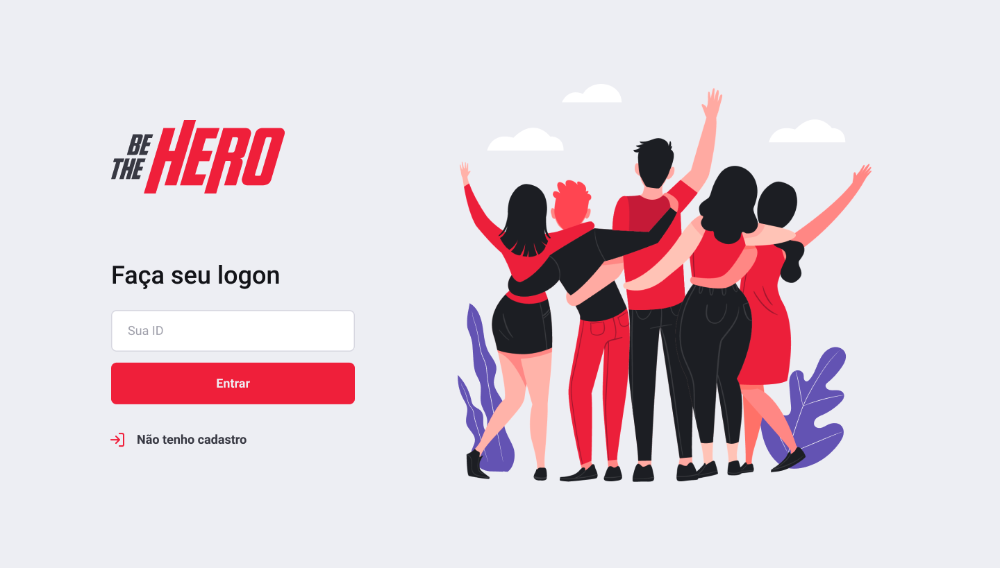
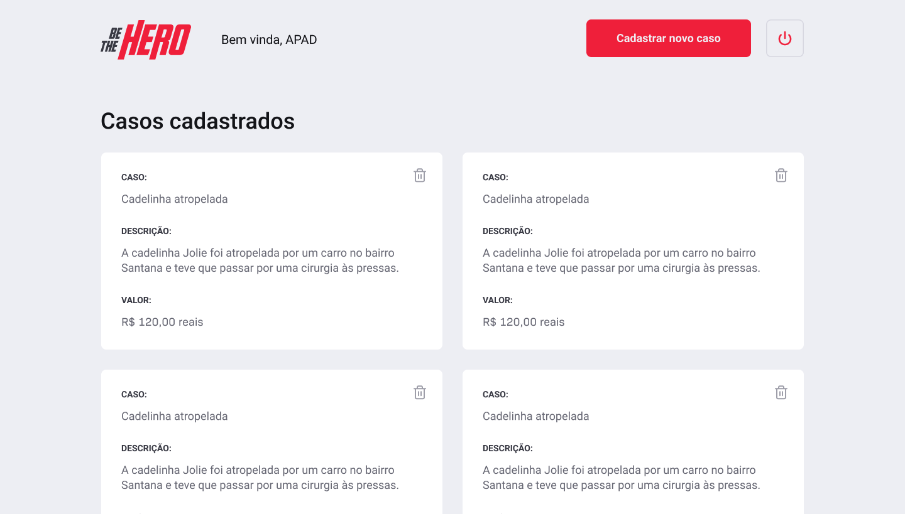
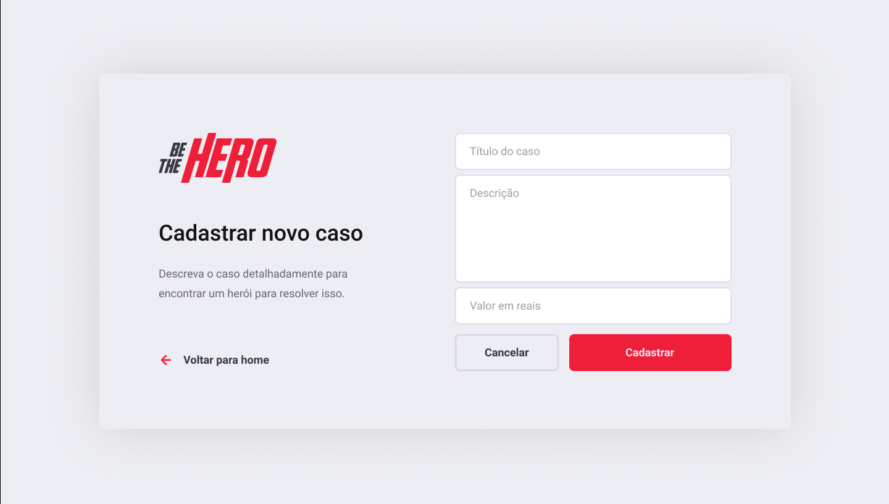
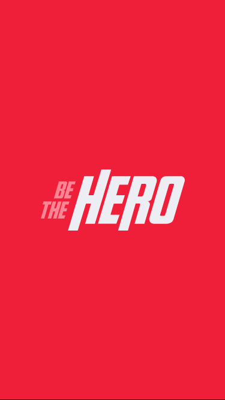
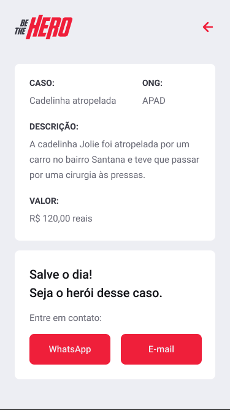

<h1 align="center">
    
</h1>

<h4 align="center">
  🚀 Semana OmniStack 11.0
</h4>

## 🚀 Stack

This is the stack used to build this project:

- [Node.js](https://nodejs.org/en/)
- [React](https://reactjs.org)
- [React Native](https://facebook.github.io/react-native/)
- [Expo](https://expo.io/)

## 💻 Project

The project BeTheHero is an application to help people get connected with ONGs that need help.

This application was develop during the Semana Omnistack, a free event organized by [Rocketseat](https://rocketseat.com.br/)

## 🔖 Layout

Here you can see some of the screens:

### Web

  
  
  

### Mobile

  
  
  

